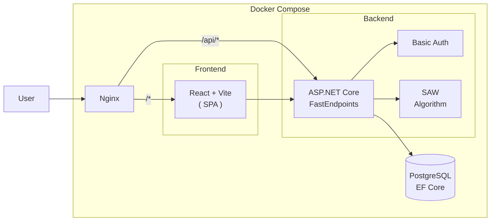
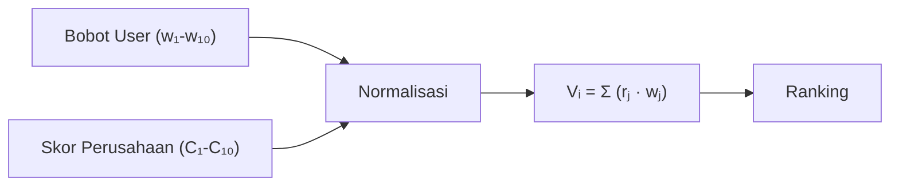

# Arsitektur Aplikasi

```mermaid
flowchart LR
    subgraph Docker["Docker Compose"]
        Nginx["Nginx"]

        subgraph FE["Frontend"]
            React["React + Vite<br/>( SPA )"]
        end

        subgraph BE["Backend"]
            API["ASP.NET Core<br/>FastEndpoints"]
            Auth["Basic Auth<br/>"]
            SAW["SAW<br/>Algorithm"]
        end

        DB[("PostgreSQL<br/>EF Core")]
    end

    User --> Nginx
    Nginx -->|"/*"| React
    Nginx -->|"/api/*"| API
    API --> Auth
    API --> SAW
    API --> DB
    React --> API
```

```mermaid
flowchart LR
    W["Bobot User (w₁-w₁₀)"] --> N["Normalisasi"]
    S["Skor Perusahaan (C₁-C₁₀)"] --> N
    N --> V["Vᵢ = Σ (rⱼ · wⱼ)"]
    V --> R["Ranking"]
```
