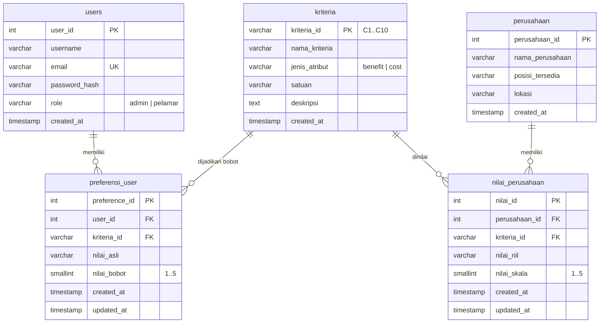
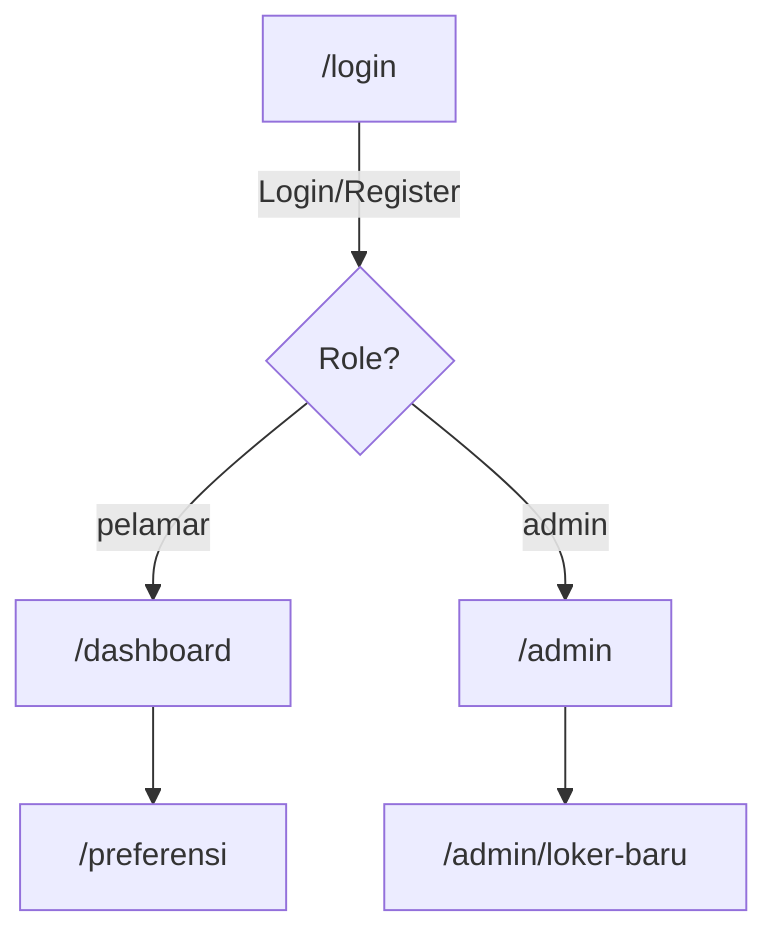

# Laporan Proyek DSS Rekomendasi Pekerjaan

## 1. Entity Relationship Diagram (ERD)



**Relasi:**
- `users` 1──N `preferensi_user` (setiap user punya banyak preferensi)
- `kriteria` 1──N `preferensi_user` (setiap kriteria bisa jadi preferensi banyak user)
- `kriteria` 1──N `nilai_perusahaan` (setiap kriteria dinilai untuk banyak perusahaan)
- `perusahaan` 1──N `nilai_perusahaan` (setiap perusahaan punya 10 nilai kriteria)

---

## 2. Site Maps

### Struktur Navigasi



### Alur Halaman

| Halaman | Route | Role | Fetch Data | Action |
|---------|-------|------|------------|--------|
| Login | `/login` | public | - | POST `/auth/login`, POST `/auth/register` |
| Dashboard Pelamar | `/dashboard` | pelamar | GET `/rekomendasi` | Lihat hasil SAW |
| Preferensi | `/preferensi` | pelamar | GET `/kriteria`, GET `/preferences` | POST `/preferences`, DELETE `/preferences` |
| Dashboard Admin | `/admin` | admin | GET `/loker` | DELETE `/loker/{id}` |
| Loker Baru | `/admin/loker-baru` | admin | GET `/kriteria` | POST `/loker` |

---

## 3. Desain Rancangan Input / Output

### 3.1 Halaman Login & Register

**Input:**
| Field | Tipe | Validasi |
|-------|------|----------|
| Email | email | required, format email |
| Password | password | required, min 6 karakter |
| Username | text | required (register only), min 3 karakter |

**Output:** Redirect ke `/dashboard` (pelamar) atau `/admin` (admin).  
**Response API (login):**
```json
{
  "success": true,
  "data": { "userId": 1, "username": "...", "email": "...", "role": "pelamar" }
}
```

---

### 3.2 Halaman Dashboard Pelamar (Rekomendasi SAW)

**Input:** Tidak ada form — data di-fetch otomatis saat mount.  
**Output:** Daftar rekomendasi loker urut berdasarkan skor SAW.

| Kolom | Sumber Data |
|-------|-------------|
| Rank | Hasil sorting SAW (1 = tertinggi) |
| Nama Perusahaan | `perusahaan.nama_perusahaan` |
| Posisi Tersedia | `perusahaan.posisi_tersedia` |
| Lokasi | `perusahaan.lokasi` |
| Detail Nilai (per kriteria) | `nilai_perusahaan.nilai_riil` |
| Skor SAW | `Σ (r_ij × w_j)` — benefit: x/max, cost: min/x |

**Response API `GET /rekomendasi`:**
```json
{
  "success": true,
  "data": [
    {
      "rank": 1,
      "perusahaanId": 3,
      "namaPerusahaan": "PT. Teknologi Maju",
      "posisiTersedia": "Backend Developer",
      "lokasi": "Jakarta Selatan",
      "skorSaw": 0.8525,
      "detailNilai": [
        { "kriteriaId": "C1", "nilaiSkala": 3, "nilaiRiil": "Rp 10.000.000" }
      ]
    }
  ]
}
```

---

### 3.3 Halaman Preferensi Pelamar

**Input:** 10 field kriteria (C1–C10).

| Kriteria | Tipe Input | Contoh Nilai |
|----------|-----------|-------------|
| C1 – Gaji | text | `Rp 8.500.000` |
| C2 – Jarak | text | `12 Km` |
| C3 – Fleksibilitas | dropdown | `Full WFO`, `Hybrid`, `Full Remote` |
| C4 – Jenjang Karir | dropdown | `Tidak Ada`, `Kurang`, `Cukup`, `Baik`, `Sangat Baik` |
| C5 – Jam Kerja & Lembur | dropdown | `Tepat Waktu`, `Jarang`, `Terjadwal`, `Sering`, `Setiap Hari` |
| C6 – Reputasi | dropdown | `Sangat Buruk` … `Sangat Baik` |
| C7 – Budaya Kerja | dropdown | `Sangat Buruk` … `Sangat Baik` |
| C8 – Fasilitas | dropdown | `Tidak Ada` … `Lengkap + ESOP` |
| C9 – Biaya Transport | text | `Rp 400.000` |
| C10 – Pelatihan | dropdown | `Tidak Ada` … `Training + Sertifikasi` |

**Output:** Pesan sukses + redirect ke `/dashboard`.  
**Konversi:** Backend otomatis mengonversi `nilai_asli` → `nilai_bobot` (skala 1–5) berdasarkan aturan per kriteria.

**Request:**
```json
{
  "preferences": [
    { "kriteriaId": "C1", "nilaiAsli": "Rp 8.500.000" }
  ]
}
```

---

### 3.4 Halaman Dashboard Admin

**Input:** Tidak ada form — data di-fetch otomatis.

**Output:** Tabel daftar loker.

| Kolom | Aksi |
|-------|------|
| ID | - |
| Nama Perusahaan | - |
| Posisi | - |
| Lokasi | - |
| Nilai (C1–C10) | Chip per kriteria (`C1=3`) |
| Aksi | Tombol **Hapus** → DELETE `/loker/{id}` |

**Response API `GET /loker`:**
```json
{
  "success": true,
  "data": [
    {
      "perusahaanId": 1,
      "namaPerusahaan": "PT. Maju",
      "posisiTersedia": "Engineer",
      "lokasi": "Jakarta",
      "nilai": [
        { "nilaiId": 1, "perusahaanId": 1, "kriteriaId": "C1", "nilaiRiil": "Rp 10.000.000", "nilaiSkala": 3 }
      ]
    }
  ]
}
```

---

### 3.5 Halaman Tambah Loker Baru

**Input:**
| Field | Tipe | Validasi |
|-------|------|----------|
| Nama Perusahaan | text | required, max 100 |
| Posisi | text | required, max 100 |
| Lokasi | text | required, max 100 |
| Nilai per Kriteria (C1–C10) | text | required per kriteria, max 255 |

**Output:** Redirect ke `/admin` dengan data baru muncul di tabel.

**Request:**
```json
{
  "namaPerusahaan": "PT. Baru",
  "posisiTersedia": "Backend Dev",
  "lokasi": "Jakarta",
  "nilaiPerKriteria": [
    { "kriteriaId": "C1", "nilaiRiil": "Rp 10.000.000" }
  ]
}
```

> **Catatan:** `nilai_skala` dihitung otomatis oleh backend dari `nilai_riil` menggunakan `NilaiKonverter`.

---

### 3.6 Auth (Stateless Basic Auth)

Tidak ada token — setiap request menyertakan:

```
Authorization: Basic base64(email:password)
```

Backend memvalidasi `email` dan `password` terhadap tabel `users` pada setiap request.

---

## 4. Tabel CRUD

| Tabel | Create | Read | Update | Delete | Keterangan |
|-------|--------|------|--------|--------|------------|
| `users` | POST `/auth/register` | - | - | - | Registrasi oleh user umum |
| `kriteria` | - | GET `/kriteria` | - | - | Data master, di-seed saat init DB |
| `preferensi_user` | POST `/preferences` | GET `/preferences` | - | DELETE `/preferences` | Replace strategy: hapus semua lalu insert baru |
| `perusahaan` | POST `/loker` | GET `/loker`, GET `/loker/{id}` | PUT `/loker/{id}` | DELETE `/loker/{id}` | CRUD penuh oleh admin |
| `nilai_perusahaan` | POST `/loker` | GET `/loker/{id}/nilai` | PUT `/loker/{id}` | DELETE `/loker/{id}` | Insert/update/delete cascade via perusahaan |

**Ringkasan CRUD per Role:**

| Role | Create | Read | Update | Delete |
|------|--------|------|--------|--------|
| **Pelamar** | Preferensi | Rekomendasi, Preferensi, Kriteria | - | Preferensi (reset) |
| **Admin** | Loker (perusahaan + nilai) | Loker, Kriteria | Loker | Loker |

**Catatan:**
- `preferensi_user` tidak memiliki update terpisah — menggunakan **replace strategy** (hapus semua baris lama, insert baris baru dalam satu transaksi)
- `nilai_perusahaan` di-create/di-update/di-delete secara **cascade** bersama `perusahaan` (EF Core `OnDelete(Cascade)`)
- `kriteria` bersifat **read-only** — diisi oleh init SQL saat container pertama kali jalan
